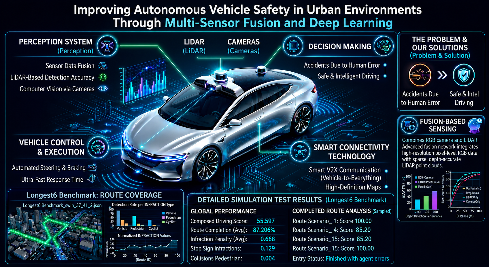

# SwinFuser: Multi-Modal Implicit Imitation Learning for Safe Autonomous Vehicles
<p align="center">
  
</p>


---

## Contents
1. [__Setup__](#setup)
2. [__Dataset__](#dataset)
3. [__Training__](#training)
4. [__Evaluation__](#evaluation)

---

## Overview

SwinFuser is an autonomous driving architecture that fuses camera and LiDAR sensor data using a three-stage bidirectional cross-modal attention mechanism built on Swin Transformer backbones. It is evaluated on the **CARLA Leaderboard Longest6** benchmark using imitation learning.

The key contribution is a **bidirectional cross-modal attention fusion** mechanism that enables rich feature exchange between RGB image features and LiDAR point cloud features at multiple stages of the network.

---

## Architecture

- **Backbone:** Swin Transformer (camera) + PointPillar (LiDAR)
- **Fusion:** Four-stage bidirectional cross-modal attention
- **Task heads:** Waypoint prediction, traffic light state, velocity
- **Training:** Imitation learning on CARLA expert demonstrations

---

## Results on CARLA Longest6

Comparison of SwinFuser with state-of-the-art methods on the Longest6 Benchmark.

| Method | DS↑ | RC↑ | IS↑ | Ped↓ | Veh↓ | Stat↓ | Red↓ | OR↓ | Dev↓ | TO↓ | Block↓ |
|--------|-----|-----|-----|------|------|-------|------|-----|------|-----|--------|
| WOR | 20.53 | 48.47 | 0.56 | 0.18 | 1.05 | 0.37 | 1.28 | 0.47 | 0.88 | 0.08 | 0.20 |
| Late Fusion | 22.47 | 83.30 | 0.27 | 0.05 | 4.63 | 0.28 | 0.11 | 0.48 | 0.02 | 0.11 | 0.21 |
| Geometric Fusion | 27.32 | 91.13 | 0.30 | 0.06 | 4.64 | 0.17 | 0.13 | 0.48 | **0.00** | **0.05** | 0.11 |
| LAV | 32.74 | 70.36 | 0.51 | 0.16 | **0.83** | 0.15 | 0.96 | 0.42 | 0.06 | 0.12 | 0.45 |
| Latent TransFuser | 37.31 | **95.18** | 0.38 | 0.03 | 3.66 | 0.18 | 0.13 | 0.04 | **0.00** | 0.12 | **0.05** |
| TransFuser | 47.30 | 93.38 | 0.50 | 0.03 | 2.45 | **0.07** | 0.16 | 0.04 | **0.00** | 0.06 | 0.10 |
| **SwinFuser (Ours)** | **55.60** | 87.21 | **0.67** | **0.02** | 1.01 | 0.10 | **0.10** | 0.05 | **0.00** | 0.13 | 0.17 |

> **DS**: Driving Score, **RC**: Route Completion, **IS**: Infraction Score, **Ped**: Collisions with pedestrians, **Veh**: Collisions with vehicles, **Stat**: Collisions with static layout, **Red**: Red light violation, **OR**: Off-road driving, **Dev**: Route deviation, **TO**: Timeout, **Block**: Vehicle Blocked. For DS/RC/IS higher is better (↑). For infractions lower is better (↓). **Bold** = best result. SwinFuser achieves the best DS and IS overall.

---

## Setup

Clone the repo, setup CARLA 0.9.10.1, and build the conda environment:

```
git clone https://github.com/amanysh99/SwinFuser.git
cd swinFuser_code_files
chmod +x setup_carla.sh
./setup_carla.sh
conda env create -f environment.yml
conda activate swinFuse
```

---

## Dataset

Our dataset is generated using a privileged agent — the autopilot (`/team_code_autopilot/autopilot.py`) — across 8 CARLA towns, utilizing the routes and scenario files provided in [this folder](tools/dataset). Refer to the [tools/dataset](tools/dataset) folder for detailed documentation on training routes and scenarios. You can download the dataset (210GB) by running:

```
chmod +x download_data.sh
./download_data.sh
```

The dataset is structured as follows:

```
- Scenario
    - Town
        - Route
            - rgb: camera images
            - depth: corresponding depth images
            - semantics: corresponding segmentation images
            - lidar: 3d point cloud in .npy format
            - topdown: topdown segmentation maps
            - label_raw: 3d bounding boxes for vehicles
            - measurements: contains ego-agent's position, velocity and other metadata
```

---

## Training

For **single GPU** training:

```
cd team_code_transfuser
python train.py --batch_size 10 --logdir /path/to/logdir --root_dir /path/to/dataset_root/ --parallel_training 0
```

For **multi-GPU distributed** training:

```
cd team_code_transfuser
torchrun --nnodes=1 --nproc_per_node=4 --max_restarts=3 --rdzv_id=$RANDOM --rdzv_backend=c10d --rdzv_endpoint=localhost:29500 --rdzv_conf=timeout=3600 train_swin.py --id swin_ptt --backbone swin_ptt --image_architecture resnet34 --lidar_architecture resnet18 --use_velocity 1 --batch_size 2 --logdir  /path/to/logdir --root_dir /path/to/dataset_root/ --parallel_training 1 --sync_batch_norm 1 --zero_redundancy_optimizer 1 --auto_resume 0 --start_epoch 0 --memory_efficient 1 --gradient_accumulation_steps 8 --save_every 1 --gpu_memory_threshold 0.85 --epochs 41 --schedule 1 --schedule_reduce_epoch_01 30 --schedule_reduce_epoch_02 40 --val_every 5
```


---

## Evaluation

The evaluation script is located at `leaderboard/scripts/local_evaluation.sh`.

>  **Before running, open the script and update these 3 variables to match your setup:**
> - `TEAM_CONFIG` → path to your model checkpoint config folder
>   ```
>   export TEAM_CONFIG=/your/path/to/model_ckpt/folder
>   ```
> - `TEAM_AGENT` → path to your `submission_agent.py` file
>   ```
>   export TEAM_AGENT=${WORK_DIR}/team_code_transfuser/Swin_PTT_Files/submission_agent.py
>   ```
> - `CHECKPOINT_ENDPOINT` → path and filename for your results output `.json`
>   ```
>   export CHECKPOINT_ENDPOINT=${WORK_DIR}/results/your_results_filename.json
>   ```

**Step 1 — Make the script executable:**

```bash
chmod +x ~/transfuser/leaderboard/scripts/local_evaluation.sh
```

**Step 2 — Start CARLA in Terminal 1:**

```bash
cd ~/transfuser/carla
./CarlaUE4.sh --world-port=2000 -opengl
```

Or for headless (no display):

```bash
./CarlaUE4.sh --world-port=2000 -RenderOffScreen
```

**Step 3 — Run evaluation in Terminal 2:**

```bash
cd ~/transfuser
./leaderboard/scripts/local_evaluation.sh
```

---

## Parsing Longest6 Results

To compute additional statistics from the results of evaluation runs we provide a parser script [tools/result_parser.py](tools/result_parser.py).

```
${WORK_DIR}/tools/result_parser.py --xml ${WORK_DIR}/leaderboard/data/longest6/longest6.xml --results /path/to/folder/with/json_results/ --save_dir /path/to/output --town_maps ${WORK_DIR}/leaderboard/data/town_maps_xodr
```

It will generate a `results.csv` file containing the average results of the run as well as additional statistics. It also generates town maps and marks the locations where infractions occurred.

```
SwinFuser/
├── config.py             # Training configuration
├── data.py               # Dataset loading
├── model.py              # Main SwinFuser model
├── swin_transfuser_ptt.py # Swin Transformer backbone
├── train_swin.py         # Training script
├── submission_agent.py   # CARLA evaluation agent
├── transfuser.py         # TransFuser baseline
├── geometric_fusion.py   # Geometric fusion module
├── late_fusion.py        # Late fusion module
├── latentTF.py           # Latent TransFuser
├── point_pillar.py       # LiDAR PointPillar encoder
└── utils.py              # Utility functions
```

---

## Citation

If you find this work useful, please cite:

```bibtex
@article{swinfuser2026,
  title={SwinFuser: Hierarchical Vision Transformers for Scene Understanding Toward Safe Autonomous Driving},
  author={Amany Sherif and Hamdy S. Heniedy and Mohammed Alrahmawy and Sara El-Metwally},
  journal={ Computer Vision and Image Understanding},
  year={2026}
}
```

---

## Acknowledgements

This work builds upon [TransFuser](https://github.com/autonomousvision/transfuser)
(Chitta et al., PAMI 2023), licensed under the MIT License.
We thank the Autonomous Vision Group for their open-source contribution.

---

## License

This project is licensed under the MIT License — see the [LICENSE](LICENSE) file for details.
